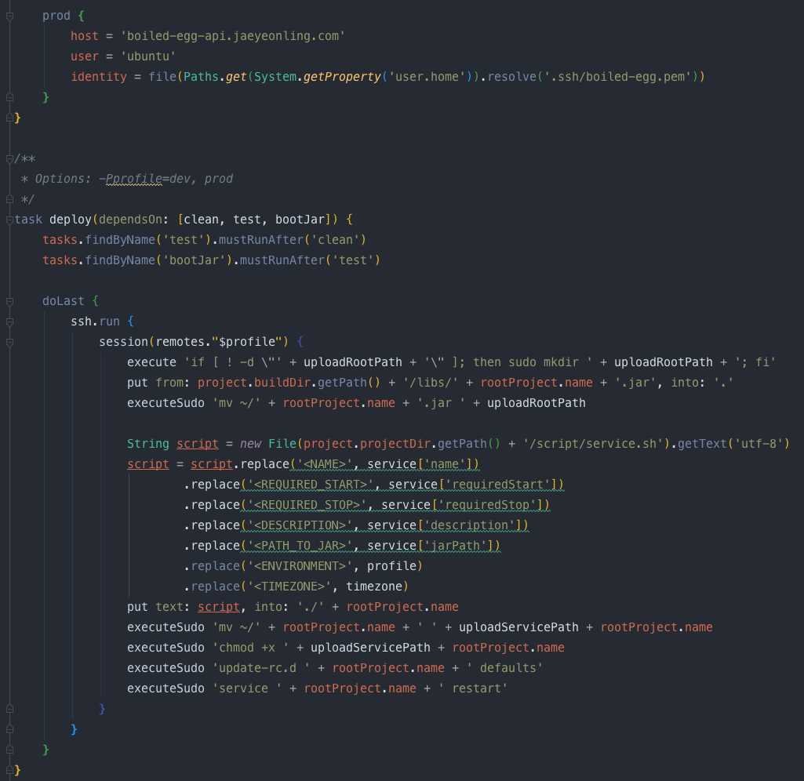
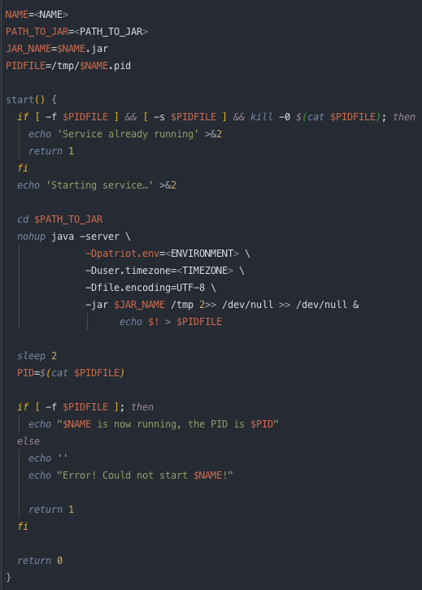
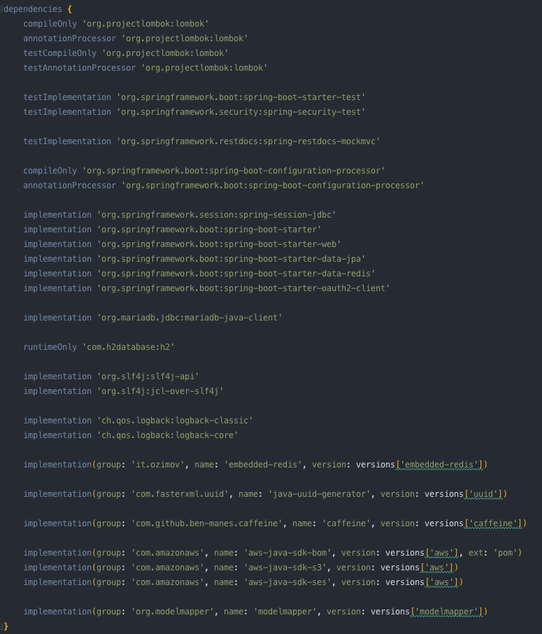
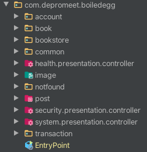
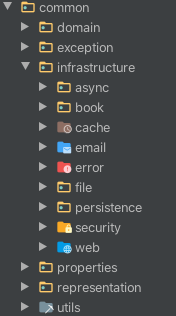
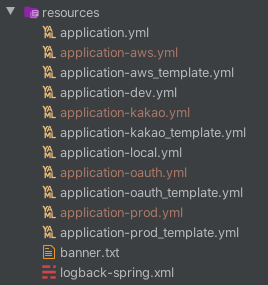

# Boiled Egg API

> 책 공유 서비스
> 
> DDD 학습을 목표로 합니다.

## 개발환경

* JDK 13

* Gradle 6

* Spring boot 2.2

## 배포

```shell script
gradle deploy -Pprofile={ORIFILE}
```





## 의존 관계



## 패키지





## 설정 파일



