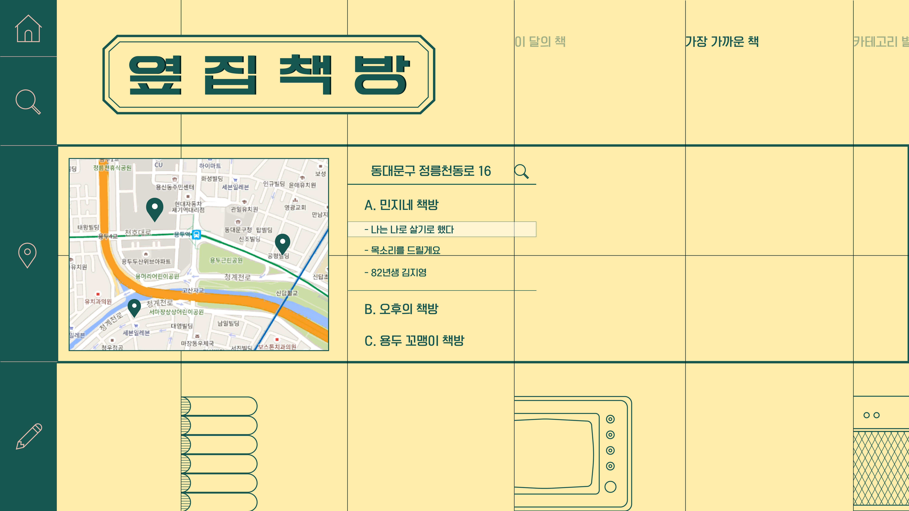
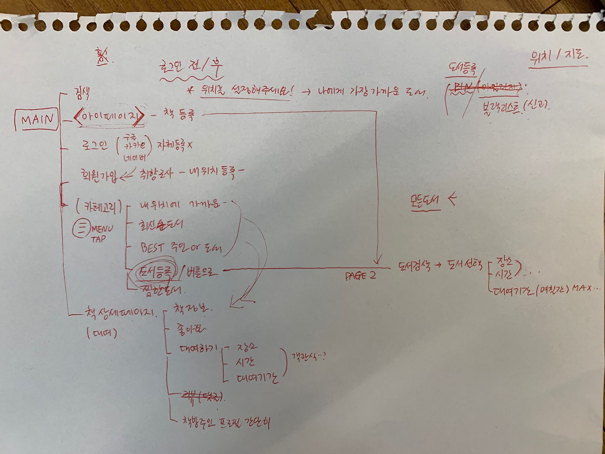

# Boiled Egg API

요즘은 주로 서점에서 새 책을 구입하거나, 중고 서점 구매, e-book 구매 등 주로 '소유'를 통해 책을 소비하고 있습니다.

그러나 2000년 대 까지만 해도 '만화방'이라는 곳에서 책을 대여할 수 있었고, 소유하지 않고도 책을 읽는 것이 가능했었습니다.

'도서관'은 우리 동네에서 가장 가까운 곳을 찾더라도 버스를 타고 이동해야 하는 경우가 많고,
이러한 이동 거리의 제약으로 인해 대여하고 반납하는 데에 어려움이 존재합니다.

그러한 문제점을 해결하면서, 공유 경제 시대에 맞는 책 대여 서비스를 만들기 위하여 만들게 되었습니다.

프론트: https://github.com/depromeet/boiled-egg-fe

Live: http://boiled-bookstore.s3-website-us-east-1.amazonaws.com/ 

## 서비스의 핵심
* 내가 읽지 않는, 또는 다 읽어서 집에 모셔두고 있는 책들을 내 주변 독자에게 일정 기간 동안 대여해주는 '공유' 서비스 입니다.
* 책을 빌려주고 빌려 읽으면서 책에 대한 감상평을 공유하고, 카테고리에 따른 게시판을 통해서 자유롭게 책에 대한 감상과 추천을 나눌 수 있습니다.
* 위치 기반으로 내 주변 대여 가능 책 목록을 볼 수 있고, 마음에 드는 책을 골라 댓글로 대여 신청을 진행 할 수 있습니다.

## 기술적 목표
* 해당 서비스를 만들기 전 Domain Driven Design(이하 DDD)에 대해 알게 되었고, DDD에 익숙해지는 것을 목표로 개발 하였습니다.
* 새로운 기술을 사용하는 것도 좋겠지만, 해당 프로젝트에서는 소프트웨어의 본질인 비즈니스 로직에 집중하였습니다.

## 회의록

### 1주차

##### 서비스 키워드

1. 편리함
2. 친근함
3. 지속가능한

##### 디자인 키워드

1. 감수성
2. 똑똑한

##### 기능

1. 위치 서비스 (GPS)
- 선호하는 장소 직접 입력 (ex: 집, 회사 학교)
- 위치 기반으로 주변 책 보여주기

2. 평가
- 책 소유주 및 대여자 평가 (평잠)
- 책 후기 (내용, 벌점)
- 블랙리스트
- 신고
3. 대여 기간 알람
4. 댓글 (채팅 대체)
5. 대여 신청 및 대여중 상태 표시
6. 로그인 / 회원가입
7. 책 추천 글
8. 커뮤니티
- 책 장르 별 게시판 (ex 판타지 소설 게시판, 인문학 게시판 등)
9. 지도 커스터마이징

##### 차주 준비해야할 것
* 디자인
1. 와이어프레임
2. 레퍼런스 서치

* 개발
1. 라이브러리

### 2주차
1. 유저 네임: 책방 주인
2. 서비스 명: 옆집 책방 (가제)
3. 간편 로그인: 네이버 / 구글 / 카카오
4. 카테고리 복수 선택
5. 가로 스크롤: 만화 책방
6. 플로우 차트
- 메인 페이지
    - 카테고리
    - 로그인
    - 회원가입
    - 마이페이지
- 회원가입 시 선호하는 책 카테고리 선택
- 블랙리스트 관리
    - 신고하기 -> 3회 이상 일정 기간 정지
- 대여
    - 가지고 있는 책 목록 등록 -> 책 별로 책을 가지고 있는 주인 목록 뜸 -> 신청 가능한 애들은 색으로
- 책 등록
    - 쇼핑 할 때 처럼 옵션 선택 (장소, 시간 대여 기간)

### 3주차
와이어 프레임

[3주차 와이어프레임](./asset/3rd-week-wireframe.ai)

### 4주차
플로우 차트

* 홈 화면
    * 아이콘 제거
    * 로고로 메인으로 이동할 수 있음
    * 로그인 전
        * 위치를 설정해 주세요
    * 로그인 후
        * 사용자가 설정한 위치 노출
        * 클릭 시 지도가 있는 화면으로 이동
        * 지도가 꼭 UI적으로 필요한지 고려

* 핀
    * 마일리지 처럼 점수 높은 회원에서 핀을 부여
    * 핀 갯수가 많을수록 추천 상단에 노출
    * 배민의 깃발 시스템과 유사

* 로그인 / 회원가입
    * 카카오 / 네이버 / 구글 로그인
    * 회원가입 시 취향 조사 필요
        * ex) 넷플릭스 초기 영화 선택 화면
        * 해당 선택 책의 어떤 부분으로 추천을 할 것인지
            * 카테고리
        * 내 위치 등록 및 닉네임 설정

* 카테고리 별 책목록 화면
    * 메뉴 탭으로 카테고리 보여줌

* 마이페이지
    * 회원 정보
        * 자기 점수 시각화 (핀 등)
    * 보유 책 등록
    * 책 대여 위치 / 시간대 / 대여기간설정 => 해당 사항이 책에 공용적으로 적용 됨

* 글 상세 (대여할 수 있는 화면)
    * 서점 주인 / 빌려간 사람 평가하기
        * 신고하기
    * 장소, 시간, 대여 기간 선택 화면
        * 책 주인이 등록한 범위 내에서 선택 가능
    * 댓글

* 책 등록화면
    * 올리려는 책 검색
    * 검색 이후 드롭 다운 or 리스팅

##### 화면 별 우선순위
1. 회원가입 / 로그인
2. 메인화면
3. 도서 등록
4. 책 상세 페이지
5. 책 목록 화면 (카테고리)
6. 회원가입 시 취향 선택 화면
7. 마이페이지

##### 책 API 리서치 결과
카카오, 네이버, 인터파크, 알라딘, 정부기관 정도가 가장 대표적이다.

이 중 네이버, 인터파크, 알라딘은 횟수 제한이 카카오 API로 구현해야할 것 같은데, 카카오 API는 카테고리 정보를 제공해주지 않는다.

즉, 무료로 책 정보를 가져올 수 있는 방법 중 카테고리를 가져올 수 있는 방법이 없다.

결과: 카테고리를 유저에게 직접 입력 받는다.

### 중간발표

[중간 발표 일러](./asset/interim-announcement.ai)

[중간 발표 PDF](./asset/interim-announcement.pdf)

[중간 발표 상세 일러](./asset/interim-announcement-detail.ai)

[중간 발표 그리드 일러](./asset/interim-announcement-grid.ai)

[중간 발표 글쓰기 페이지 XD](./asset/interim-announcement-write-page.xd)

##### 알림 방식에 대한 논의

1. WebSocket
2. Server Sent Events
3. Polling

### 5주차

1. 대여 장소 설정: 처음 설정한 위치 + 기타 입력(기본 장소와 동일 버튼)
2. 대여 기간: 캘린더에서 설정
3. 대여중 상태 표시 > 반납완료 버튼 누른 후 자동 해제 (대여가능 상태)
4. 대여 시 커뮤니케이션: 쪽지 기능 > 추후 앱 개발시 추가 / 현재는 간편로그인 이메일로 알람 메일 보내서 모바일에서 확인 가능하도록 함
5. 책 분야 카테고리 추가
6. 메인 화면 노출 전에 미리 '내 위치' 설정하는 페이지 노출 (가장 가까운 책 카테고리를 위함) > 지도는 구글꺼 사용(커스텀은 추후 논의!)

### 6주차

[6주차 글쓰기 페이지 PDF](./asset/6th-week-write-page.pdf)

[6주차 글쓰기 페이지 XD](./asset/6th-week-write-page.xd)

[6주차 상세 카테고리 PDF](./asset/6th-week-detail-category.pdf)

[6주차 상세 카테고리 XD](./asset/6th-week-detail-category.xd)

[6주차 로그인 회원기입 내위치 메인 메인 메뉴 알람 PDF](./asset/6th-week-signin-signup-mylocation-main-menu-alarm.pdf)

[6주차 로그인 회원기입 내위치 메인 메인 메뉴 알람 XD](./asset/6th-week-signin-signup-mylocation-main-menu-alarm.xd)

### 7주차

1. 제플린에서 다운 받을 수 있게 XD > '구성 요소 만들기' 등록해놓기
2. 대여 완료 시 대여 정보 팝업 추가 (이메일 정보 보여주기)
3. 대여중인 책 > 카테고리 목록에서는 숨기고 / 마이페이지에서만 내 등록 도서에 '대여중' 표시
4. 팝업 알림 > 알림이 여러개 일 경우 스크롤 생기게 / 반납 알림 등 다른 알림도 추가
5. 로그인 > 간편로그인만 사용 (페이지 수정)
6. 도서 등록 시 대여 / 반납 시간
7. 시, 분 나누지 말고 시간대로 설정 / 예) 7:00 ~8:00
8. 대여 / 반납 시간 추가 시 모습 디자인 추가

## 개발환경

* JDK 13
* Gradle 6
* Spring boot 2.2

### URL
- API: http://boiled-egg-api.jaeyeonling.com:8080
- Docs: http://boiled-egg-api.jaeyeonling.com:8080/docs/index.html

## 요구사항
1. [x] 회원가입 / 로그인
    - [x] 제 3자 OAuth 2.0 (간편인증) 인증을 할 수 있다.
        - [x] 구글로 인증을 받을 수 있다.
        - [x] 네이버로 인증을 받을 수 있다.
        - [x] 카카오로 인증을 받을 수 있다.
    - [x] 회원가입 시도 시 이미 등록된 계정이 있다면 해당 계정으로 로그인된다.
    - [x] 로그인 시도 시 등록된 계정이 아니라면 회원가입 후 로그인된다.

2. 시스템
    - [x] 서버 시간을 확인할 수 있다.

3. 책
    - [x] 책을 등록할 수 있다.
        - [x] 책을 등록하면 빌려줄 수 있는 상태가 된다.
    - [x] 모든 책들을 조회할 수 있다.
        - [x] 페이징을 할 수 있다.
        - [x] 인기 기준으로 정렬할 수 있다.
        - [x] 날짜 기준으로 정렬할 수 있다.
        - [x] 페이징과 정렬을 같이 할 수 있다.
    - [ ] 책들을 검색할 수 있다.
        - [ ] 제목 기준으로 검색할 수 있다.
        - [ ] ISBN 기준으로 검색할 수 있다.
    - [x] 책의 세부 정보를 조회할 수 있다.
        - 조회 정보
            - 식별자
            - 책을 등록한 사람의 식별자
            - ISBN
            - 좋아요 갯수 (인기)
         - [x] 책이 없다면 예외처리 한다.
    - [x] 책에 좋아요 표시를 할 수 있다.
        - [ ] 중복해서 좋아요를 표시할 수 없다.
    - [x] 책의 세부 정보 조회 시 책이 없다면 예외처리 한다.
        - [x] 책이 없다면 예외처리 한다.
    - [x] 외부 API를 통해 책 정보를 검색할 수 있다.
        - 조회 정보
            - 제목
            - 줄거리
            - 글쓴이
            - 번역가
            - ISBN
            - 가격
            - 출판사
            - 썸네일
            - 출간일
        - [x] 제목 기준으로 조회할 수 있다.
        - [x] ISBN 기준으로 조회할 수 있다.

3. 책방
    - 책방은 책을 등록한 유저들을 뜻한다.
    - [x] 책방을 등록할 수 있다.
    - [x] 모든 책방들을 조회할 수 있다.
        - [x] 페이징을 할 수 있다.
        - [x] 인기 기준으로 정렬할 수 있다.
        - [x] 날짜 기준으로 정렬할 수 있다.
        - [ ] 위치 기준으로 정렬할 수 있다.
        - [x] 페이징과 정렬을 같이 할 수 있다.
    - [ ] 책방들을 검색할 수 있다.
        - [ ] 이름 기준으로 검색할 수 있다.
        - [ ] 위치 기준으로 검색할 수 있다.
    - [x] 책의 세부 정보를 조회할 수 있다.
        - 조회 정보
            - 이름
            - 설명
            - 위치 (위도, 경도)
            - 좋아요 갯수 (인기)
         - [x] 책방이 없다면 예외처리 한다.
    - [x] 책방에 좋아요 표시를 할 수 있다.
        - [ ] 중복해서 좋아요를 표시할 수 없다.

4. 알람
    - 시스템 상의 알람을 뜻한다.
    - 클라이언트에서 서버로 Polling 하여 요청을 받아간다.
    - [x] 내게 발생한 알람들을 조회할 수 있다.
        - [x] 알람을 확인했다면 조회되지 않는다.
    - [x] 알람의 세부 정보를 조회할 수 있다.
        - 조회 정보
            - 알람을 보내는 사람의 식별자
            - 알람을 받는 사람의 식별자 (내 식별자)
            - 이벤트 종류
        - [x] 시스템이 보내는 알람일 경우 보낸 유저의 식별자는 0이다.
        - [x] 세부 정보 조회는 확인하였어도 조회할 수 있다.
    - [x] 알람을 확인한다.
        - [x] 이미 확인한 알람일 경우 예외처리 한다.
        - [x] 내 알람이 아니라면 예외처리 한다.
    - 알람은 특정한 상황에 발생한다.
        - [ ] 대여 요청의 상태가 변경됐을 때 알람이 발생한다.
        - [ ] 반납 완료일이 다가올 때 알림이 발생한다.

5. 유저
    - [x] 유저의 정보를 조회할 수 있다.
        - 조회 정보
            - 식별자
            - 이메일
            - 이름
            - 프로필 사진
            - 닉네임
    - [x] 유저가 등록한 책들을 조회할 수 있다.
    - [x] 유저가 빌려준 책들의 리스트를 조회할 수 있다.
    - [x] 유저가 빌린 책들의 리스트를 조회할 수 있다.
    - [x] 유저의 정보를 수정할 수 있다.
        - [x] 이름
        - [x] 닉네임
        - [x] 프로필 사진

6. 대여
    - 책을 빌려주는 사람은 소유자라고 한다.
    - 책을 빌리는 사람은 요청자라고 한다.
    - [x] 대여를 생성할 수 있다.
        - 대여 생성은 대여 요청을 뜻한다.
    - [x] 모든 대여들을 조회할 수 있다.
        - [x] 페이징을 할 수 있다.
        - [x] 날짜 기준으로 정렬할 수 있다.
        - [x] 페이징과 정렬을 같이 할 수 있다.
    - [ ] 대여들을 검색할 수 있다.
        - [ ] 빌려준 사람 기준으로 검색할 수 있다.
        - [ ] 빌린 사람 기준으로 검색할 수 있다.
        - [ ] 책 기준으로 검색할 수 있다.
    - [x] 책의 세부 정보를 조회할 수 있다.
        - 조회 정보
            - 이름
            - 설명
            - 위치 (위도, 경도)
            - 좋아요 갯수 (인기)
         - [x] 책방이 없다면 예외처리 한다.
    - [x] 책을 빌려줄 수 있다.
        - [x] 책을 등록한다면 빌릴 수 있는 상태가 된디.
    - [x] 책을 빌릴 수 있다.
        - [x] 등록된 책에 대여 요청을 할 수 있다.
        - [x] 책을 찾을 수 없다면 예외처리 한다.
        - [x] 책을 빌리는 것은 대여 요청이 생성되는 것으로 시작된다.
        - [x] 이미 대여중인 책에 대여 요청 시 예외처리 한다.
        - [ ] 책 대여 요청이 오면 책 소유자는 알람을 받는다.
    - [x] 소유자는 대여 신청을 거절할 수 있다.
        - [x] 대여 정보가 없다면 예외처리 한다.
        - [x] 대여의 상태가 대여 신청 대기가 아니라면 예외처리 한다.
        - [x] 소유자가 아니라면 예외처리 한다.
        - [ ] 대여 요청자는 거절됐다는 알람을 받는다.
    - [x] 소유자는 대여 신청을 수락할 수 있다.
        - [x] 대여 정보가 없다면 예외처리 한다.
        - [x] 대여의 상태가 대여 요청 대기가 아니라면 예외처리 한다.
        - [x] 소유자가 아니라면 예외처리 한다.
        - [x] 이미 대여중인 책에 대여 요청 시 예외처리 한다.
        - [x] 책의 상태가 빌려진 상태로 변경된다.
        - [ ] 대여 요청자는 수락됐다는 알람을 받는다.
    - [x] 요청자는 대여 신청을 취소할 수 있다.
        - [x] 대여 정보가 없다면 예외처리 한다.
        - [x] 대여의 상태가 대여 요청 대기가 아니라면 예외처리 한다.
        - [x] 요청자가 아니라면 예외처리 한다.
        - [ ] 소유자는 취소됐다는 알람을 받는다.
    - [x] 요청자는 책을 반납할 수 있다.
        - [x] 대여 정보가 없다면 예외처리 한다.
        - [x] 대여의 상태가 대여 중이 아니라면 예외처리 한다.
        - [x] 요청자가 아니라면 예외처리 한다.
        - [ ] 소유자는 책이 반납됐다는 알람을 받는다.
    - [x] 소유자는 대여를 완료할 수 있다.
        - [x] 대여 정보가 없다면 예외처리 한다.
        - [x] 대여의 상태가 책 반납이 아니라면 예외처리 한다.
        - [x] 소유자가 아니라면 예외처리 한다.
        - [x] 책의 상태가 대기 상태로 변경된다.
        - [ ] 요청자는 완료됐다는 알람을 받는다.
    - [ ] 대여에 대해 서로를 평가할 수 있다.
        - TODO
    - [ ] 반납일이 다가오면 책을 빌린 유저는 알람을 받는다.
    - 워크 플로우
        - 대여 신청 -> 거절
            - 유저가 책을 등록한다.
            - 빌리는 유저가 등록한 책에 대여 신청한다.
            - 책을 등록한 유저가 거절한다.
        - 대여 신청 -> 대여 -> 취소
            - 유저가 책을 등록한다.
            - 빌리는 유저가 등록한 책에 대여 신청한다.
            - 책을 등록한 유저가 대여를 승인한다.
            - 책을 빌리는 유저가 대여 신청을 취소한다.
        - 대여 신청 -> 대여 -> 반납 -> 완료
            - 유저가 책을 등록한다.
            - 빌리는 유저가 등록한 책에 대여 신청한다.
            - 책을 등록한 유저가 대여를 승인한다.
            - 책을 빌린 유저가 책을 익은 후 반납한다.
            - 책을 받은 유저가 대여를 완료한다.

## 용어 사전

| 한글명 | 영문명 | 설명 |
| --- | --- | --- |
| 책 | Book | `책 대여 서비스`의 핵심 도메인이다. |
| 유저 | User | `책 대여 서비스`을 사용하는 대상을 뜻하며, `책`을 대여할 수도 있고 대여 받을 수도 있다. |
| 책방 | Bookstore | `책`을 빌려주는 `유저`를 뜻한다. |
| 알람 | Notification | 서비스에서 발생하는 이벤트를 뜻한다. |
| 대여 | Transaction | `책`을 빌리거나 빌려주는 작업을 뜻한다. |
| 식별자 | ID | 도메인의 유일한 아이디를 나타낸다. |
| 좋아요 갯수 | LikeCount | 받은 좋아요의 갯수를 나타낸다. |
| 이메일 | Email | `유저`의 정보를 나타낸다. |
| 이름 | Name | `유저`의 정보를 나타낸다. |
| 프로필 사진 | Picture | `유저`의 정보를 나타낸다. |
| 국제표준도서번호 | ISBN | `책`의 식별자인 아이디를 나타낸다. |
| 제목 | Title | `책`의 정보를 나타낸다. |
| 줄거리 | Contents | `책`의 정보를 나타낸다. |
| 글쓴이 | Author | `책`의 정보를 나타낸다. |
| 번역가 | Translator | `책`의 정보를 나타낸다. |
| 가격 | Price | `책`의 정보를 나타낸다. |
| 출판사 | Publisher | `책`의 정보를 나타낸다. |
| 썸네일 | Thumbnail | `책`의 정보를 나타낸다. |
| 소설 | Novel | `책`의 카테고리 중 하나이다. |
| 시 | Poetry | `책`의 카테고리 중 하나이다. |
| 에세이 | Essay | `책`의 카테고리 중 하나이다. |
| 경제경영 | Economic Management | `책`의 카테고리 중 하나이다. |
| 자기계발 | Self Development | `책`의 카테고리 중 하나이다. |
| 인문 | Humanities | `책`의 카테고리 중 하나이다. |
| 역사 | History | `책`의 카테고리 중 하나이다. |
| 문화 | Culture | `책`의 카테고리 중 하나이다. |
| 정치 | Politics | `책`의 카테고리 중 하나이다. |
| 사회 | Society | `책`의 카테고리 중 하나이다. |
| 건강 | Health | `책`의 카테고리 중 하나이다. |
| 의학 | Medicine | `책`의 카테고리 중 하나이다. |
| 소설 | Novel | `책`의 카테고리 중 하나이다. |
| 국어 | National Language | `책`의 카테고리 중 하나이다. |
| 외국어 | Foreign Language | `책`의 카테고리 중 하나이다. |
| 교재 | Textbook | `책`의 카테고리 중 하나이다. |
| 수험서 | Examination Book | `책`의 카테고리 중 하나이다. |
| IT | IT | `책`의 카테고리 중 하나이다. |
| 프로그래밍 | Programming | `책`의 카테고리 중 하나이다. |
| 과학 | Science | `책`의 카테고리 중 하나이다. |
| 공학 | Engineering | `책`의 카테고리 중 하나이다. |
| 예술 | Art | `책`의 카테고리 중 하나이다. |
| 대중문화 | Popular Culture | `책`의 카테고리 중 하나이다. |
| 종교 | Religion | `책`의 카테고리 중 하나이다. |
| 가정 | Home | `책`의 카테고리 중 하나이다. |
| 생활 | Life | `책`의 카테고리 중 하나이다. |
| 요리 | Cooking | `책`의 카테고리 중 하나이다. |
| 여행 | Trip | `책`의 카테고리 중 하나이다. |
| 취미 | Hobby | `책`의 카테고리 중 하나이다. |
| 매거진 | Magazine | `책`의 카테고리 중 하나이다. |
| 청소년교양 | Youth Culture | `책`의 카테고리 중 하나이다. |
| 아동 | Child | `책`의 카테고리 중 하나이다. |
| 유아 | Infant Child | `책`의 카테고리 중 하나이다. |
| e 오디오북 | E Audio Book | `책`의 카테고리 중 하나이다. |
| 북모닝 CEO | Book Morning CEO | `책`의 카테고리 중 하나이다. |
| 외국 | Foreign | `책`의 카테고리 중 하나이다. |
